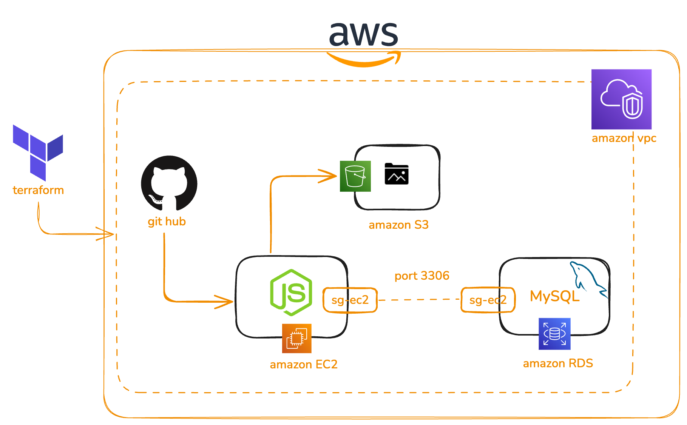
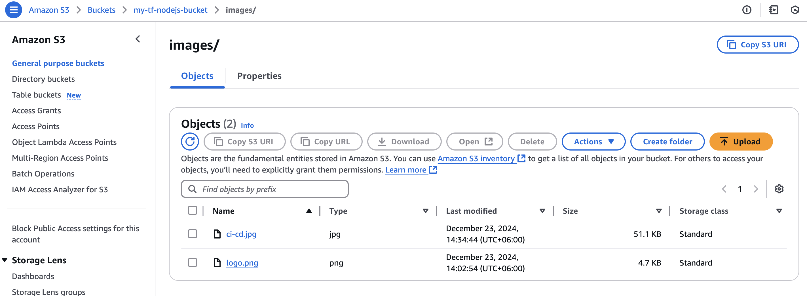
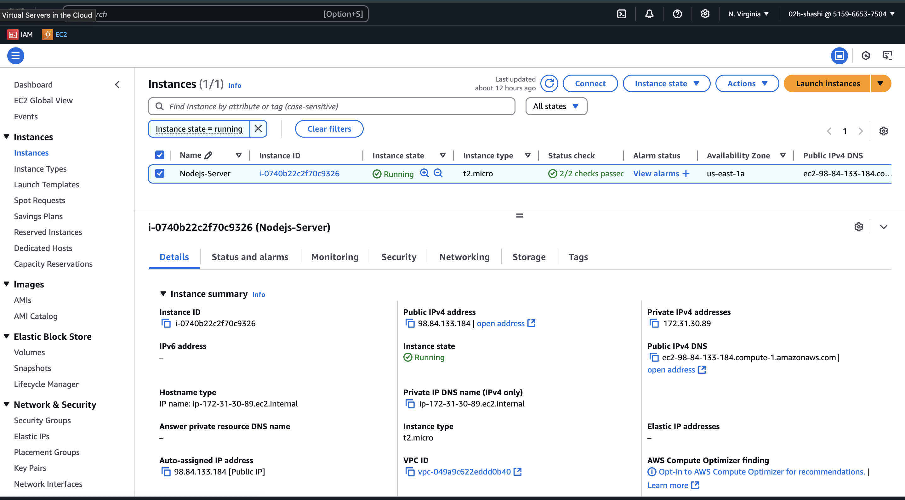

Automating AWS Infrastructure with Terraform: A Step-by-Step Guide


**Part 1: Setting Up the Environment**

This section outlines the steps to set up the environment needed to automate AWS infrastructure using Terraform. By the end of this part, you will have a configured Terraform environment ready to provision AWS resources.

---

### **Step 1.1: Install AWS Toolkit for VS Code**

The AWS Toolkit is an extension for Visual Studio Code that simplifies managing AWS services directly from your IDE.

1. Open **Visual Studio Code**.
2. Go to the Extensions Marketplace by clicking the Extensions icon (or press `Ctrl+Shift+X`).
3. Search for "AWS Toolkit" and click **Install**.

Once installed, you can use the AWS Explorer in VS Code to manage AWS services easily.

---

### **Step 1.2: Configure IAM User Credentials**

To interact with AWS using Terraform, you need IAM credentials with programmatic access.

1. **Create an IAM User**:

   - Log in to the **AWS Management Console**.
   - Navigate to **IAM > Users**.
   - Create a new user with **Programmatic Access**.
   - Attach policies like **AmazonS3FullAccess**, **AmazonEC2FullAccess**, and **AmazonRDSFullAccess** (or customize as per requirements).

2. **Download the Access Key and Secret Key**:

   - Save the credentials securely as you will need them for configuration.

3. **Set up AWS CLI Credentials**:
   - Open your terminal and configure AWS CLI:
     ```bash
     aws configure
     ```
   - Enter the **Access Key**, **Secret Key**, default region (e.g., `us-east-1`), and default output format (`json`).

---

### **Step 1.3: Create Terraform Project Folder**

Organize your Terraform configuration files in a dedicated folder.

1. Create a folder for the project:

   ```bash
   mkdir terraform
   cd terraform
   ```

2. Inside the folder, create a file named `provider.tf`:
   ```hcl
   provider "aws" {
   region = "us-east-1"
   shared_credentials_files = ["~/.aws/credentials"]
   profile                  = "terraform-key"
   }
   ```
   - This configuration tells Terraform to use your AWS credentials stored in the default profile of `~/.aws/credentials`.

---

### **Step 1.4: Initialize Terraform**

Terraform requires initialization to download necessary plugins for providers.

1. Run the following command in the Terraform folder:
   ```bash
   terraform init
   ```
2. You should see an output similar to:
   ```
   Terraform has been successfully initialized!
   ```

---

After completing these steps, your Terraform environment is set up, and you're ready to define resources like S3 buckets, EC2 instances, and more. Proceed to Part 2 to start provisioning AWS resources.

**Part 2: Automating S3 Bucket and Object Management**

In this section, we will automate the creation of an S3 bucket and the management of objects (e.g., uploading files) using Terraform.

---

### **Step 2.1: Define the S3 Bucket in Terraform**

1. Inside your Terraform project folder, create a new file named `s3_bucket.tf`:

   ```hcl
   resource "aws_s3_bucket" "tf_s3_bucket" {
   bucket = "my-tf-nodejs-bucket"
   tags = {
    Name        = "sas_nodejs_bucket"
    Environment = "Dev"
   }
   }

   ```

   - **`aws_s3_bucket`**: Creates the S3 bucket with a specified name.
   - **`aws_s3_bucket_versioning`**: Enables versioning for the bucket to protect against accidental deletions.

2. Save the file.

---

### **Step 2.2: Add Objects to the Bucket**

1. In the same folder, create a new file named `s3_objects.tf`:
   ```hcl
   resource "aws_s3_object" "tf_s3_object" {
   bucket = aws_s3_bucket.tf_s3_bucket.bucket
   for_each = fileset("../public/images", "**")
   key    = "images/${each.key}"
   source = "../public/images/${each.key}"
   }
   ```
   - **`aws_s3_object`**: Uploads a file to the specified path inside the bucket.

---

### **Step 2.3: Add Outputs for Bucket Information**

1. Create a file named `outputs.tf` to retrieve useful information about the bucket:

   ```hcl
   output "bucket_name" {
     value = aws_s3_bucket.tf_s3_bucket.bucket
   }

   output "bucket_arn" {
     value = aws_s3_bucket.tf_s3_bucket.arn
   }
   ```

---

### **Step 2.4: Apply the Terraform Configuration**

1. Initialize Terraform again if needed:

   ```bash
   terraform init
   ```

2. Preview the resources to be created:

   ```bash
   terraform plan
   ```

   - The plan command shows the actions Terraform will take to create the bucket and upload the file.

3. Apply the configuration:
   ```bash
   terraform apply
   ```
   - Confirm with `yes` when prompted.

---

### **Step 2.5: Verify the S3 Bucket and Objects**

1. Log in to the **AWS Management Console**.
2. Navigate to the **S3 Service**.
3. Verify:
   - The bucket with the specified name exists.
   - The uploaded file appears in the specified path.

---

### **Step 2.6: Clean Up Resources (Optional)**

If you no longer need the bucket and objects, you can destroy them:

```bash
terraform destroy
```

- Confirm with `yes` to delete all resources managed by this Terraform configuration.

---

By completing this part, you have automated the creation of an S3 bucket and the management of objects. Proceed to **Part 3** to work on EC2 instance provisioning.
**Part 3: Automating EC2 Instance Setup**

This section will guide you through automating the provisioning and configuration of an EC2 instance using Terraform.

---

### **Step 3.1: Define the EC2 Instance in Terraform**

1. Create a file named `ec2_instance.tf` in your Terraform project:

   ```hcl
   resource "aws_instance" "tf_ec2_instance" {
   ami           = var.ami_id
   instance_type = var.instance_type
   key_name = "terraform-ec2-key"
   associate_public_ip_address = true
   vpc_security_group_ids = [aws_security_group.tf_ec2_sg.id]
   depends_on = [ aws_s3_object.tf_s3_object ]
   user_data = <<-EOF
            #!/bin/bash

             # Update and install dependencies
             sudo apt update -y
             sudo apt install -y git nodejs npm

             # Ensure the /home/ubuntu directory exists
             # sudo mkdir -p /home/ubuntu
             # sudo chown ubuntu:ubuntu /home/ubuntu


             # Git clone the repository
             git clone https://github.com/verma-kunal/nodejs-mysql.git /home/ubuntu/nodejs-mysql
             cd /home/ubuntu/nodejs-mysql

            # Check Ownership and Permissions:
            sudo chown -R ubuntu:ubuntu /home/ubuntu/nodejs-mysql

             # Create .env file with placeholder environment variables
            echo "DB_HOST=${local.rds_endpoint}" | sudo tee .env
            echo "DB_USER=${aws_db_instance.tf_rds_instance.username}" | sudo tee -a .env
            echo "DB_PASS=${aws_db_instance.tf_rds_instance.password}" | sudo tee -a .env
            echo "DB_NAME=${aws_db_instance.tf_rds_instance.db_name}" | sudo tee -a .env
            echo "TABLE_NAME=users" | sudo tee -a .env
            echo "PORT=3000" | sudo tee -a .env

             # Install dependencies and start the server
             npm install

            EOF
   user_data_replace_on_change = true
   tags = {
    Name = var.app_name
   }
   }
   ```

2. Update the **AMI ID** (`ami-0abcdef1234567890`) to match your region and instance needs. Use the [AWS AMI Finder](https://aws.amazon.com/amis/) or your AWS Management Console to get the correct AMI.

---

### **Step 3.2: Define a Security Group**

1. Create a new file named `security_group.tf` to define a security group:

   ```hcl
   resource "aws_security_group" "tf_ec2_sg" {
   name        = "Nodejs-server-sg"
   description = "Allow Http and ssh"
   vpc_id      = var.vpc_id //default vpc id

    ingress {
    description = "TLS from VPC"
    from_port        = 443
    to_port          = 443
    protocol         = "tcp"
    cidr_blocks      = ["0.0.0.0/0"] //allow from all ips
   }
    ingress {
    description = "SSH"
    from_port        = 22
    to_port          = 22
    protocol         = "tcp"
    cidr_blocks      = ["0.0.0.0/0"]
   }
    ingress {
    description = "TCP"
    from_port        = 3000 //for nodejs
    to_port          = 3000
    protocol         = "tcp"
    cidr_blocks      = ["0.0.0.0/0"]
   }
    ingress {
    description      = "MySQL"
    from_port        = 3306
    to_port          = 3306
    protocol         = "tcp"
    cidr_blocks      = ["0.0.0.0/0"] // allow from all IPs
   }
    egress {
    from_port        = 0
    to_port          = 0
    protocol         = "-1"
    cidr_blocks      = ["0.0.0.0/0"]
   }
   }
   ```

2. Attach the security group to the EC2 instance by updating `ec2_instance.tf`:

   ```hcl
   resource "aws_instance" "my_instance" {
     ami           = "ami-0abcdef1234567890"
     instance_type = "t2.micro"
     key_name      = var.key_name

     vpc_security_group_ids = [aws_security_group.my_security_group.id]

     tags = {
       Name = "MyTerraformInstance"
     }
   }
   ```

---

### **Step 3.3: Add Key Pair for SSH Access**

1. Create a file named `variables.tf` to define a variable for the key pair:
   ```hcl
   variable "ami_id" {
   type = string
   default = "ami-0e2c8caa4b6378d8c"
   description = "ami image"
   }
   variable "instance_type" {
   type = string
   default = "t2.micro"
   }
   variable "app_name" {
   type = string
   default = "Nodejs-Server"
   ```

}
variable "vpc_id" {
type = string
default = "vpc-049a9c622eddd0b40"
}

````

2. Provide the key pair name in `terraform.tfvars`:
```hcl
# key_name = "my-key-pair"  # Replace with your AWS key pair name

````

Ensure the private key file for this key pair is available on your local machine for SSH access.

---

### **Step 3.4: Add Outputs for Instance Details**

1. Create an `outputs.tf` file to display useful information about the EC2 instance:
   ```hcl
   output "instance_public_ip" {
     value = aws_instance.tf_ec2_instance.public_ip
   }
   ```

output "instance_id" {
value = aws_instance.tf_ec2_instance.id
}
output "ssh_to_ec2_instance" {
value = "ssh -i ~/.ssh/terraform-ec2-key.pem ubuntu@${aws_instance.tf_ec2_instance.public_ip}"
}

````

---

### **Step 3.5: Apply the Terraform Configuration**

1. Initialize Terraform (if not done already):
```bash
terraform init
````

2. Preview the configuration:

   ```bash
   terraform plan
   ```

3. Apply the configuration:
   ```bash
   terraform apply
   ```
   Confirm with `yes` when prompted.

---

### **Step 3.6: Verify the EC2 Instance**

1. Log in to the **AWS Management Console**.
2. Navigate to the **EC2 Service**.
3. Verify:
   - The instance is running.
   - The security group allows SSH and HTTP access.

---

### **Step 3.7: Access the EC2 Instance**

Use the private key file associated with your key pair to SSH into the instance:

```bash
ssh -i /path/to/private-key.pem ec2-user@<INSTANCE_PUBLIC_IP>
ssh -i ~/.ssh/terraform-ec2-key.pem ubuntu@${aws_instance.tf_ec2_instance.public_ip}
```

Replace `/path/to/private-key.pem` with the path to your private key and `<INSTANCE_PUBLIC_IP>` with the public IP address of the instance.

---

### **Step 3.8: Clean Up Resources (Optional)**

If you no longer need the instance, you can destroy it:

```bash
terraform destroy
```

Confirm with `yes` to delete the EC2 instance and associated resources.

---

By completing this part, you have automated the setup of an EC2 instance with a security group and key pair for SSH access. Proceed to **Part 4** for additional configurations or enhancements.

**Part 4: Automating RDS MySQL Setup**

In this section, we'll automate the creation of an RDS MySQL instance using Terraform. RDS (Relational Database Service) makes it easier to set up, operate, and scale a MySQL database in AWS.

---

### **Step 4.1: Define RDS MySQL Instance in Terraform**

1. Create a new file named `rds_mysql.tf` to define the RDS MySQL instance:

   ```hcl
   resource "aws_db_instance" "tf_rds_instance" {
   allocated_storage    = 10
   db_name              = "shashi_demo"
   identifier           = "nodejs-rds-mysql"
   engine               = "mysql"
   engine_version       = "8.0"
   instance_class       = "db.t3.micro"
   username             = "admin"
   password             = "shashi123"
   parameter_group_name = "default.mysql8.0"
   skip_final_snapshot  = true
   publicly_accessible = true
   vpc_security_group_ids = [ aws_security_group.tf_rds_sg.id ]
   }
   ```

````
2. add locals and outputs
locals {
rds_endpoint = element(split(":", aws_db_instance.tf_rds_instance.endpoint),0)
}

---

### **Step 4.2: Define MySQL Username and Password as Variables**

<!-- 1. Create a `variables.tf` file to define the MySQL credentials as variables:

```hcl
variable "db_username" {
  description = "The username for the MySQL database"
  type        = string
}

variable "db_password" {
  description = "The password for the MySQL database"
  type        = string
  sensitive   = true  # Mark as sensitive to avoid logging the password
}
````

2. Provide values for these variables in a `terraform.tfvars` file:

   ````hcl
   db_username = "mydbuser"  # Set the database username
   db_password = "mypassword123"  # Set a strong database password
   ``` -->
   ````

---

### **Step 4.3: Configure Security Groups for RDS Access**

If you have not defined a security group for RDS, update `security_group.tf` to ensure RDS can accept connections from the EC2 instance or from any other source you specify.

1. Define or update your security group:

   ```hcl
   resource "aws_security_group" "tf_rds_sg" {
   name        = "allow_mysql"
   description = "Allow mysql traffic"
   vpc_id      = "vpc-049a9c622eddd0b40" //default vpc id
   ```

ingress {
description = "Allow MySQL from EC2"
from_port = 3306
to_port = 3306
protocol = "tcp"
cidr_blocks = ["0.0.0.0/0"] //any ip
security_groups = [aws_security_group.tf_ec2_sg.id]// EC2 instance security group ID
}
egress {
from_port = 0
to_port = 0
protocol = "-1"
cidr_blocks = ["0.0.0.0/0"]
}
}

````

Adjust the **CIDR blocks** to restrict access as per your security requirements.

---

### **Step 4.4: Define Outputs for RDS Instance Details**

1. In the `outputs.tf` file, add outputs to capture important details about your RDS instance:

```hcl
output "rds_endpoint" {
value =  local.rds_endpoint
}
output "rds_username" {
value = aws_db_instance.tf_rds_instance.username
}
output "db_name" {
value = aws_db_instance.tf_rds_instance.db_name
}
````

These outputs will show the endpoint and instance ID after creation, which you can use to connect to the RDS instance.

---

### **Step 4.5: Apply the Terraform Configuration**

1. Initialize Terraform if you haven't already:

   ```bash
   terraform init
   ```

2. Preview the infrastructure changes:

   ```bash
   terraform plan
   ```

3. Apply the configuration to create the RDS MySQL instance:

   ```bash
   terraform apply
   ```

   Confirm with `yes` when prompted.

---

### **Step 4.6: Verify the RDS Instance**

1. After the apply completes, go to the **AWS Management Console**.
2. Navigate to **RDS** under the **Services** section.
3. Verify:
   - The RDS MySQL instance is created and in the "Available" state.
   - The endpoint is available for connecting to the database.

---

### **Step 4.7: Connect to the RDS MySQL Instance**

You can connect to the MySQL database using the **endpoint** and **port** provided in the Terraform output.

Use MySQL client or any database management tool (e.g., MySQL Workbench, DBeaver) to connect.

Example command using the MySQL client:

```bash
mysql -h <RDS_ENDPOINT> -P 3306 -u mydbuser -p
```

Enter the password when prompted.

---

### **Step 4.8: Clean Up Resources (Optional)**

To destroy the RDS instance and associated resources:

```bash
terraform destroy
```

Confirm with `yes` to delete the RDS instance and other resources created by Terraform.

---

By completing this part, you've successfully automated the creation of an RDS MySQL instance using Terraform, and you can easily scale, manage, and maintain your database instance in AWS. You can now proceed to configure additional resources or enhance your infrastructure as needed.

#####notes for mysql in rds

Check the database in rds from the ec2 instance
Firstly ssh to the ec2 instance using the command which is given by the output after the ec2 creation:
ssh -i ~/.ssh/terraform-ec2-key.pem ubuntu@98.84.133.184
Then apply the command:
mysql -h nodejs-rds-mysql.cpm2wm4ealfl.us-east-1.rds.amazonaws.com -u admin -p
It will prompt for giving password .
Create database and input data
CREATE DATABASE shashi_demo;

use shashi_demo;

CREATE TABLE users (
id INT AUTO_INCREMENT PRIMARY KEY,
name VARCHAR(100) NOT NULL,
email VARCHAR(100) NOT NULL
);

INSERT INTO users (name, email) VALUES ('John Doe', 'john@example.com');
INSERT INTO users (name, email) VALUES ('Jane Smith', 'jane@example.com');
INSERT INTO users (name, email) VALUES ('shashikanta ', 'kanta@gmail.com');

Step 6: Run Terraform to Apply

terraform plan
terraform apply
After Terraform finishes provisioning, use the output command to SSH into your EC2 instance.SSH into the instance using the provided public IP. Ensure that the Node.js application is running by accessing the appropriate port (e.g., http://<public_ip>:3000).

### go to nodejs-mysql folder

```bash
npm start
```

then go to browser and hit http://<public_ip>:3000


This Terraform configuration enables you to automate the creation of EC2 instances, security groups, and the deployment of a Node.js application connected to an RDS MySQL database. By using Terraform, you can maintain reproducibility and consistency in your infrastructure.
Happy Terraforming!

# NodeJs app with MySQL Database

A simple nodejs app connected with mySQL database.

## Getting Started

1. Clone the repo

```bash
git clone https://github.com/verma-kunal/nodejs-mysql.git
cd nodejs-mysql
```

2. Create a `.env` file in root directory and add the environment variables:

```bash
DB_HOST="localhost"
DB_USER="root" # default mysql user
DB_PASS=""
DB_NAME=""
TABLE_NAME=""
PORT=3000
```

> Make sure to create the database and the corresponding table in your mySQL database. 3. Initialize and start the development server:

```bash
npm install
npm run dev
```


